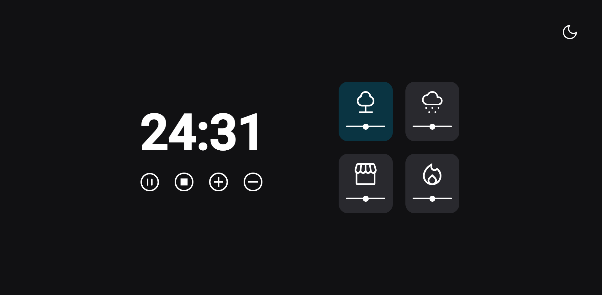

<h1 align="center">Focus Timer Dark Mode 🕛</h1>

Contador baseado na técnica Pomodoro, aonde é possivel incrementar e decrementar minutos, reproduzir e pausar sons  de ambiente, e alternar entre Dark e Light mode

<h2 align="center">Tecnologias utilizadas</h2>

  

<a href="https://chrishenderson07.github.io/focus-timer-dark-mode/"><h2 align="center">🔗Abrir e Rodar o projeto🔗</h2>

</a>
